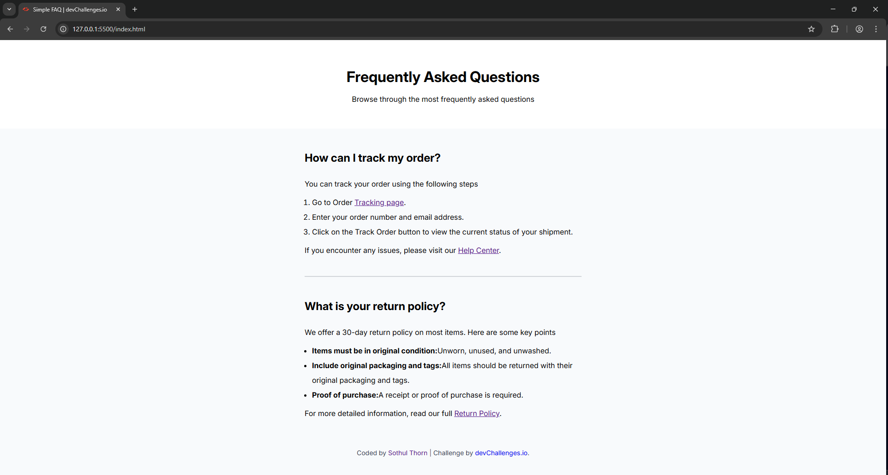

<!-- Please update value in the {}  -->

<h1 align="center">Simple FAQ | devChallenges</h1>

   Solution for a challenge <a href="https://devchallenges.io/challenge/simple-faq-challenge" target="_blank">Simple FAQ</a> from <a href="http://devchallenges.io" target="_blank">devChallenges.io</a>.

  <h3>
    <a href="{https://your-demo-link.your-domain}">
      Demo
    </a>
     | 
    <a href="{https://your-url-to-the-solution}">
      Solution
    </a>
     | 
    <a href="https://devchallenges.io/challenge/simple-faq-challenge">
      Challenge
    </a>
  </h3>

<!-- TABLE OF CONTENTS -->

## Table of Contents

- [Overview](#overview)
  - [What I learned](#what-i-learned)
  - [Useful resources](#useful-resources)
- [Built with](#built-with)
- [Features](#features)
- [Contact](#contact)
- [Acknowledgements](#acknowledgements)

<!-- OVERVIEW -->

## Overview

A simple FAQ page built with semantic HTML and CSS.  
The layout focuses on a clean, centered card with clear typography and spacing for better readability.

### What I learned

- How to horizontally center a fixed-width content block using `margin: 0 auto` instead of flex/grid.
- How global resets (`* { margin: 0; padding: 0; }`) affect default list styling and how to fix bullet/number alignment.
- How to import and apply a Google Font (Inter) and verify that it’s actually being used.
- How to use semantic elements (`<section>`, `<h1>`, `<h2>`, `<ul>`, `<ol>`) to structure content for accessibility.

### Useful resources

- [MDN – Box model](https://developer.mozilla.org/en-US/docs/Learn/CSS/Building_blocks/The_box_model) – Helped me understand how margins and padding affect centering and card layout.
- [MDN – List styles](https://developer.mozilla.org/en-US/docs/Web/CSS/list-style) – Useful for fixing bullet/number alignment inside bordered containers.
- [Google Fonts – Inter](https://fonts.google.com/specimen/Inter) – Reference for importing and using the Inter typeface.

### Built with

- **Semantic HTML5 markup** – Used headings, lists, and paragraphs to describe the FAQ structure clearly.
- **CSS custom properties** – Prepared the stylesheet to be easily extendable (e.g. colors, spacing, typography) for future iterations.
- **Vanilla CSS only** – No frameworks; focused on understanding the fundamentals of layout and typography.

## Features

- Centered FAQ card layout with clear hierarchy between questions and answers.
- Semantic and accessible structure using headings, lists, and descriptive link text.

This application/site was created as a submission to a [DevChallenges](https://devchallenges.io/challenges-dashboard) challenge.

## Acknowledgements

- Thanks to [DevChallenges](https://devchallenges.io/challenges-dashboard) for the design brief and project idea.
- MDN Web Docs for being the main reference for HTML and CSS behavior.

## Author

- GitHub [@sothulthorn](https://github.com/sothulthorn)
